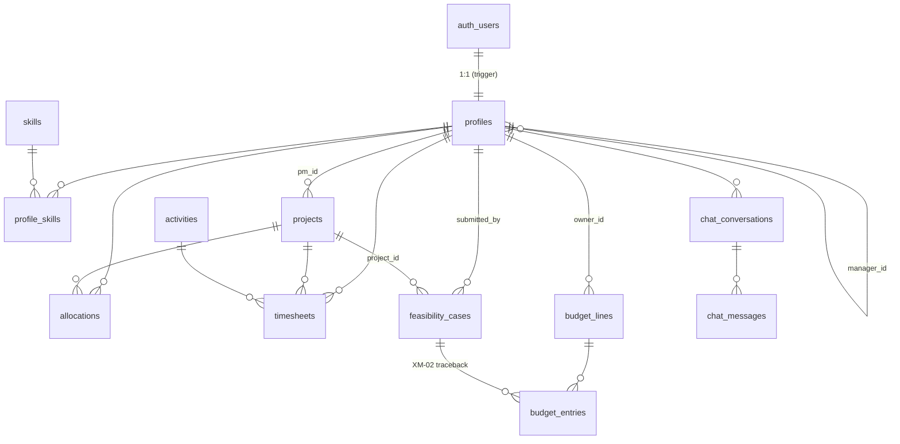

# DDD — Database Design Document

| | |
|---|---|
| **Dokumen** | Database Design Document |
| **Produk** | TANIA — Portal Digital Product & Solution |
| **Basis data** | PostgreSQL (Supabase managed) |
| **Versi** | 1.0 (draft) |
| **Tanggal** | 26 Agustus 2026 |
| **Audiens** | Tim pengembang, DBA, reviewer teknis |

---

## 1. Tujuan & Batas Dokumen

Dokumen ini menjelaskan **rancangan** basis data TANIA beserta alasannya: model entitas, strategi kunci, kebijakan integritas referensial, desain data turunan, strategi indeks, pola RLS, dan siklus hidup data.

> **Bukan kamus data.** Daftar kolom per tabel beserta tipe dan constraint-nya ada di `TRD.md` §4 dan tidak diulang di sini. DDD menjawab *mengapa dirancang demikian*; TRD menjawab *bentuk persisnya*. Bila keduanya berbeda dengan `supabase/migrations/`, **migrasi yang berlaku**.

---

## 2. Prinsip Desain

| # | Prinsip | Konsekuensi |
|---|---|---|
| P-1 | **Basis data adalah pagar keamanan**, bukan sekadar penyimpanan | RLS wajib di setiap tabel; policy ditulis dalam migrasi yang sama dengan tabelnya |
| P-2 | **Angka turunan dihitung basis data**, tidak disimpan ganda | Generated column dan view; klien tidak pernah mengagregasi ulang |
| P-3 | **Nilai keputusan distempel server** | Trigger mengisi `submitted_at`, `approved_by`, `decided_by`, `decided_at` |
| P-4 | **Skema append-only** | Migrasi yang sudah diterapkan tidak pernah diedit; koreksi = migrasi baru |
| P-5 | **Constraint mendahului validasi aplikasi** | Aturan yang benar-benar harus berlaku ditulis sebagai constraint, bukan hanya di form |
| P-6 | **Jejak audit terpisah dari data operasional** | `audit_log` tidak memiliki foreign key ke `profiles`, sehingga bertahan melewati penghapusan |

---

## 3. Entity Relationship Diagram



`audit_log` sengaja tidak digambar: ia tidak memiliki relasi formal ke tabel mana pun (lihat P-6).

---

## 4. Katalog Entitas & Kardinalitas

| Entitas | Peran domain | Kardinalitas penting |
|---|---|---|
| `profiles` | Identitas & peran; akar seluruh otorisasi | 1:1 dengan `auth.users`; self-reference `manager_id` (hierarki satu tingkat) |
| `skills` / `profile_skills` | Competency matrix (TM-02) | N:M, dengan atribut `level` dan `is_certified` pada tabel penghubung |
| `projects` / `activities` | Master data terkendali (TS-03) | 1:N ke timesheet dan alokasi |
| `allocations` | Rencana penugasan (WA-01) | Satu baris per (talent, proyek, bulan) |
| `timesheets` | Effort aktual (TS-01) | Satu baris per (talent, proyek, aktivitas, hari) |
| `feasibility_cases` | Gerbang keputusan proyek (PF) | 1:N dari pengaju; 0..1 ke proyek yang terbentuk |
| `budget_lines` / `budget_entries` | Anggaran (BC) | 1:N; entry menyimpan tautan opsional ke feasibility case |
| `audit_log` | Jejak perubahan (XM-05) | Tanpa relasi formal — sengaja |
| `chat_*` | Avatar (AV) | Privat per pemilik |

**Catatan desain hierarki.** `manager_id` memodelkan satu tingkat atasan langsung, bukan pohon organisasi. `is_manager_of()` memeriksa satu tingkat saja. Bila kelak dibutuhkan hierarki berjenjang, itu perubahan desain — bukan sekadar query rekursif tambahan — karena seluruh policy approval bertumpu pada asumsi satu tingkat ini.

---

## 5. Strategi Kunci

| Pola | Dipakai pada | Alasan |
|---|---|---|
| `uuid` + `gen_random_uuid()` | Seluruh tabel operasional | Aman dibuat di klien maupun server; tidak membocorkan volume data lewat id berurutan |
| `uuid` diwarisi dari `auth.users` | `profiles.id` | Menghindari kolom pemetaan tambahan; `auth.uid()` langsung dapat dipakai policy |
| `bigint generated always as identity` | `audit_log.id` | Volume tertinggi, hanya ditulis berurutan, tidak pernah dirujuk relasi lain |
| PK gabungan | `profile_skills (profile_id, skill_id)` | Kombinasi itu sendiri adalah identitasnya; tidak perlu surrogate key |
| Unique key natural | `projects.code`, `activities.code`, `skills.name` | Kode bisnis harus unik dan dipakai manusia |
| Unique key komposit | `allocations`, `timesheets`, `budget_lines` | Mencegah duplikasi ganda pada level basis data, bukan level form |

---

## 6. Integritas Referensial

### 6.1 Matriks ON DELETE

| Relasi | Aksi | Maksud |
|---|---|---|
| `profiles.id` → `auth.users.id` | CASCADE | Profil tidak boleh yatim tanpa akun |
| `profiles.manager_id` → `profiles.id` | SET NULL | Manager keluar tidak menghapus anggotanya |
| `profile_skills.*` | CASCADE | Kompetensi tidak bermakna tanpa pemiliknya |
| `allocations.profile_id` / `project_id` | CASCADE | Rencana hilang bersama objeknya |
| `timesheets.profile_id` | **CASCADE** | — lihat §6.2 |
| `timesheets.project_id` / `activity_id` | **RESTRICT** | Melindungi catatan waktu: master data tidak boleh dihapus selama masih dirujuk |
| `timesheets.approved_by` | SET NULL | Riwayat approval bertahan meski approver keluar |
| `feasibility_cases.submitted_by` | RESTRICT | Pengaju tidak dapat dihapus selama kasusnya ada |
| `feasibility_cases.decided_by` / `project_id` | SET NULL | Keputusan bertahan; identitas pemutus boleh hilang |
| `budget_entries.budget_line_id` | CASCADE | Entry tidak bermakna tanpa budget line |
| `budget_entries.feasibility_case_id` | SET NULL | Tautan jejak boleh putus tanpa menghapus entry |
| `budget_entries.created_by` | RESTRICT | Pencatat tidak dapat dihapus selama entry-nya ada |
| `chat_*` | CASCADE | Percakapan milik pribadi ikut terhapus |

### 6.2 Ketidakkonsistenan yang perlu diputuskan

Rancangan saat ini melindungi catatan timesheet dari **penghapusan proyek** (RESTRICT) tetapi tidak dari **penghapusan orang**:

```
DELETE auth.users(x)
   └─ CASCADE ─► profiles(x)
        └─ CASCADE ─► timesheets milik x   ← seluruh riwayat effort hilang
        └─ CASCADE ─► allocations milik x
```

Sementara itu penghapusan orang yang sama akan **gagal** bila ia pernah mengajukan feasibility case atau mencatat budget entry (keduanya RESTRICT). Jadi perlindungannya tidak konsisten: bergantung pada peran apa yang kebetulan pernah dijalankan orang tersebut.

**Yang meringankan:** `audit_trigger()` juga menyala pada penghapusan berantai, sehingga baris yang terhapus masih terekam di `audit_log.before_data`. Data tidak lenyap sepenuhnya, tetapi tidak lagi berupa baris hidup dan tidak lagi masuk perhitungan utilisasi.

**Rekomendasi:** jangan pernah menghapus pengguna. Pakai `is_active = false`. Bila penghapusan keras tetap dibutuhkan, ubah `timesheets.profile_id` menjadi RESTRICT lewat migrasi baru agar konsisten dengan perlindungan yang sudah diberikan pada `project_id`. Keputusan ini dicatat sebagai celah G-2 (§14).

---

## 7. Desain Constraint Domain

Aturan yang benar-benar harus berlaku ditulis sebagai constraint, bukan sekadar validasi form (P-5):

| Constraint | Tabel | Melindungi dari |
|---|---|---|
| `hours > 0 and hours <= 24` | `timesheets` | Entry mustahil (negatif, 30 jam sehari) |
| `percent > 0 and percent <= 150` | `allocations` | Alokasi nol atau tak masuk akal; batas 150% sengaja longgar agar overload dapat *dicatat* lalu terdeteksi WA-03 |
| `period_month = date_trunc('month', period_month)` | `allocations` | Periode setengah bulan yang merusak pengelompokan |
| `level between 1 and 5` | `profile_skills` | Skala kompetensi di luar definisi |
| `score_* between 0 and 5` | `feasibility_cases` | Skor di luar skala sebelum pembobotan |
| `amount <> 0` | `budget_entries` | Entry kosong; **negatif diizinkan** sebagai mekanisme koreksi |
| `plan_amount >= 0` | `budget_lines` | Plan negatif |
| `action in ('INSERT','UPDATE','DELETE')` | `audit_log` | Nilai aksi di luar tiga yang dikenal |

**Yang sengaja tidak diberi constraint:** jumlah alokasi seorang talent lintas proyek dalam satu bulan tidak dibatasi 100%. Overload harus *terlihat* (WA-03), bukan dicegah — mencegahnya hanya memindahkan masalah ke luar sistem.

---

## 8. Desain Data Turunan

| Objek | Jenis | Alasan pemilihan bentuk |
|---|---|---|
| `feasibility_cases.total_score` | Generated column, STORED | Nilainya fungsi murni dari lima kolom di baris yang sama. Generated column membuatnya mustahil ditulis klien dan mustahil basi |
| `budget_summary` | View | Agregasi lintas baris `budget_entries`; tidak bisa jadi generated column. View menjamin komitmen dan realisasi tidak pernah tersimpan basi di `budget_lines` |
| `utilization_monthly` | View | Menggabungkan timesheet, profil, dan kalender hari kerja; berubah setiap approval |

Keduanya memakai `security_invoker = true` sehingga RLS pemanggil tetap berlaku saat membaca view — tanpa itu, view akan menjadi lubang yang melewati seluruh policy.

**Batas rancangan `utilization_monthly`:** kalender hari kerja dibangkitkan `generate_series` untuk rentang −1 sampai +2 tahun terhadap tahun berjalan. Di luar rentang itu, view tidak menghasilkan baris. Menambah tabel `holidays` (keputusan D3 pada BRD) berarti mengubah view ini lewat migrasi baru.

---

## 9. Strategi Indeks

### 9.1 Indeks yang ada (9)

| Indeks | Mendukung |
|---|---|
| `profiles(manager_id)` | `is_manager_of()` pada setiap approval |
| `profiles(squad)` | Filter dan heatmap per squad (WA-04) |
| `projects(pm_id)` | Policy PM atas proyeknya |
| `allocations(period_month)`, `allocations(profile_id)` | Tampilan alokasi per bulan dan per orang |
| `timesheets(profile_id, work_date)` | Grid mingguan — pola query utama modul TS |
| `timesheets(status)` | Antrean approval |
| `timesheets(project_id)` | Rekap per proyek |
| `feasibility_cases(decision)`, `(submitted_by)` | Pipeline kanban dan daftar milik pengaju |
| `budget_entries(budget_line_id)` | Agregasi `budget_summary` |
| `audit_log(table_name, record_id)` | Penelusuran riwayat satu record |
| `chat_conversations(profile_id)`, `chat_messages(conversation_id)` | Riwayat percakapan |

### 9.2 Celah indeks yang diketahui

| Celah | Dampak | Penilaian |
|---|---|---|
| `profile_skills(skill_id)` tidak terindeks sendiri | PK adalah (`profile_id`, `skill_id`), sehingga pencarian **"siapa yang punya skill X"** — pola query inti TM-04 — tidak dapat memakai indeks itu dan berujung sequential scan | Pada skala puluhan talent, dampaknya tidak terasa. Tambahkan indeks bila jumlah baris `profile_skills` melewati beberapa ribu |
| `budget_entries(feasibility_case_id)` tidak terindeks | Penelusuran balik XM-02 dari feasibility case ke komitmen anggaran | Volume kecil; belum mendesak |

Keduanya dicatat sebagai celah, bukan cacat: menambah indeks pada tabel kecil justru menambah biaya tulis tanpa manfaat baca yang terasa. Tinjau ulang setelah satu tahun data nyata.

---

## 10. Pola Desain RLS

Empat pola berulang. Tabel baru SEBAIKNYA memakai salah satunya, bukan menciptakan pola kelima.

| Pola | Bentuk | Dipakai pada |
|---|---|---|
| **Baca semua, tulis terbatas peran** | `select` untuk `authenticated`; `all` untuk peran tertentu | `skills`, `projects`, `activities`, `allocations` |
| **Milik sendiri** | `profile_id = auth.uid()` pada USING dan WITH CHECK | `chat_conversations`, `chat_messages`, sebagian `profiles` |
| **Milik sendiri + atasan + pimpinan** | Baca: `own or is_manager_of(profile_id) or role in (leads)`. Approve: `profile_id <> auth.uid() and (is_manager_of(...) or role in (leads))` | `timesheets` |
| **Berjenjang peran** | `get_my_role() in (...)` | `budget_lines`, `budget_entries`, `audit_log` |

**Peringatan pola.** Dua policy UPDATE pada satu tabel **tidak** menghasilkan gabungan yang aman: USING dan WITH CHECK dievaluasi terpisah lalu di-OR, sehingga policy A dapat menyumbang izin baris lama dan policy B izin baris baru. Untuk aturan transisi status, pakai trigger BEFORE UPDATE — bukan sepasang policy.

**Aturan pendukung yang membuat pola di atas aman:**

1. Fungsi helper (`get_my_role`, `is_manager_of`) HARUS `stable` + `security definer` + `set search_path` + dicabut dari `anon` — tanpa `security definer`, policy pada `profiles` yang membaca `profiles` akan rekursif.
2. Policy UPDATE yang mengubah status dipisah menjadi dua policy dengan WITH CHECK berbeda (pemilik vs approver). Karena policy permissive di-OR, pemisahan inilah yang mencegah pemilik menyetujui barisnya sendiri.
3. Tabel yang hanya boleh ditulis trigger (`audit_log`) tidak diberi policy INSERT sama sekali; triggernya `security definer`.

---

## 11. Katalog Trigger & Fungsi

| Objek | Jenis | Fungsi |
|---|---|---|
| `set_updated_at()` | trigger BEFORE UPDATE | Menjaga `updated_at` pada 8 tabel |
| `handle_new_user()` | trigger AFTER INSERT `auth.users` | Membuat baris `profiles` otomatis (SECURITY DEFINER) |
| `get_my_role()` | fungsi SQL stable | Peran pemanggil untuk policy |
| `is_manager_of(uuid)` | fungsi SQL stable | Relasi atasan satu tingkat |
| `guard_profile_privileges()` | trigger BEFORE UPDATE | Menolak perubahan `role`, `is_active`, `manager_id` oleh non-admin |
| `stamp_timesheet_transitions()` | trigger BEFORE UPDATE | Stempel `submitted_at`, `approved_by` |
| `stamp_feasibility_decision()` | trigger BEFORE UPDATE | Stempel `decided_by`, `decided_at`; **menolak keputusan tanpa rationale** |
| `enforce_timesheet_transition()` | trigger BEFORE UPDATE | Menegakkan state machine TS-02 dengan melihat OLD dan NEW sekaligus |
| `audit_trigger()` | trigger AFTER I/U/D | Menulis `audit_log` pada 5 tabel (SECURITY DEFINER) |

---

## 12. Siklus Hidup Data & Estimasi Pertumbuhan

Estimasi berikut memakai asumsi yang dinyatakan terbuka; ganti dengan angka nyata setelah satu bulan berjalan.

*Asumsi: 50 talent aktif, 5 baris timesheet per orang per minggu, 3 operasi tulis per baris (buat, submit, approve).*

| Tabel | Baris/tahun (estimasi) | Ukuran/tahun (estimasi) | Sifat |
|---|---|---|---|
| `timesheets` | ± 13.000 | ± 3 MB | Tumbuh tetap; kecil |
| `allocations` | ± 1.200 | < 1 MB | Kecil |
| `audit_log` | ± 40.000+ | **± 40 MB** | **Pendorong pertumbuhan utama** — menyimpan `before_data` dan `after_data` JSONB |
| `feasibility_cases`, `budget_*` | ratusan | < 1 MB | Kecil |
| `chat_messages` | bergantung pemakaian Avatar | bervariasi | Di luar MVP |

**Kesimpulan.** Terhadap kuota 500 MB free tier, timesheet bukan masalah; `audit_log` yang perlu diawasi. Pada laju estimasi di atas, kuota tidak terancam pada tahun pertama, tetapi kebijakan retensi harus ditetapkan sebelum tahun kedua (BRD D7, SRS DR-10). Opsi yang tersedia: arsipkan `audit_log` lebih dari 12 bulan ke berkas backup lalu hapus, atau simpan `before_data` hanya untuk kolom yang berubah.

**Kebijakan penghapusan:** tidak ada. Seluruh entitas bisnis dipertahankan; penonaktifan memakai `is_active` (profil) dan `status` (proyek). Lihat §6.2 mengenai bahaya penghapusan keras.

---

## 13. Strategi Migrasi

| Aturan | Ketentuan |
|---|---|
| Penamaan | `YYYYMMDDHHMMSS_short_name.sql` |
| Sifat | Append-only; migrasi yang sudah diterapkan tidak pernah diedit |
| Isi wajib | Tabel baru = `enable row level security` + policy eksplisit + trigger `set_updated_at` bila ada `updated_at` |
| Setelah apply | Regenerasi `database.types.ts`, perbaiki type error, `npm run build` |
| Rollback | Tidak ada rollback otomatis; koreksi selalu berupa migrasi maju |

Migrasi di repositori (tujuh berkas): `20260825000001_init_schema`, `20260825000002_rls_policies`, `20260825000003_seed_master_data`, `20260826000001_avatar_chat`, `20260826000002_profile_manager_not_self`, `20260827000001_approval_separation_of_duties`, `20260827000002_timesheet_transition_guard`.

**Status penerapan.** Seluruh berkas terverifikasi dapat diterapkan berurutan pada PostgreSQL 16 bersih. Sampai dokumen ini ditulis, belum ada bukti migrasi pernah diterapkan ke project Supabase mana pun.

---

## 14. Celah Desain yang Diketahui

| # | Celah | Dampak | Perbaikan |
|---|---|---|---|
| ~~G-1~~ | ~~Tidak ada constraint yang mencegah `profiles.manager_id = profiles.id`~~ | — | **DITUTUP** oleh `20260826000002_profile_manager_not_self.sql`. Migrasi memperbaiki data yang sudah melanggar lalu memasang `check (manager_id is null or manager_id <> id)` |
| **G-2** | `timesheets.profile_id` CASCADE sementara `project_id` RESTRICT | Menghapus pengguna menghapus riwayat effortnya, sedangkan menghapus proyek dilarang demi melindungi data yang sama | Putuskan: larang penghapusan pengguna sebagai prosedur, atau ubah ke RESTRICT (§6.2) |
| ~~G-7~~ | ~~Dua policy UPDATE pada `timesheets` dapat dikombinasikan: USING dari policy pemilik + WITH CHECK dari policy approver memperbolehkan pemilik mengubah barisnya sendiri dari `draft` langsung ke `approved`~~ | — | **DITUTUP** oleh `20260827000002_timesheet_transition_guard.sql`. PostgreSQL meng-OR seluruh USING terhadap baris lama dan seluruh WITH CHECK terhadap baris baru secara terpisah, sehingga pasangan policy mengizinkan transisi yang tidak diizinkan satu pun di antaranya. Trigger BEFORE UPDATE melihat OLD dan NEW bersamaan |
| **G-3** | Ambang WA-03 dan BC-04 tidak tersimpan sebagai data | Dokumen requirement meminta ambang yang dapat dikonfigurasi; nilainya kini tetap di aplikasi | Tabel `thresholds` bila keputusan menghendaki (PRD §6) |
| **G-4** | Bobot scoring PF-02 terkunci di generated column | Divergensi sadar terhadap requirement "configurable" | Keputusan BRD D1 |
| **G-5** | `profile_skills(skill_id)` dan `budget_entries(feasibility_case_id)` tanpa indeks | Sequential scan pada pencarian talent per skill | Tambah indeks bila volume tumbuh (§9.2) |
| **G-6** | Kebijakan retensi `audit_log` belum ada | Kuota 500 MB terancam pada tahun kedua | Keputusan BRD D7 |

G-1 sudah ditutup. Sisanya adalah keputusan yang harus diambil sadar, bukan cacat yang harus diperbaiki sebelum go-live.

**SF-2.8 kini tertutup penuh.** Keputusan 27 Agustus 2026: pemisahan tugas berlaku untuk seluruh peran — timesheet chapter lead disetujui **admin**, dan sebaliknya. Migrasi `20260827000001_approval_separation_of_duties.sql` menambahkan `profile_id <> auth.uid()` pada policy approval.

Tidak ada kebuntuan: `chapter_lead` dan `admin` dapat saling menyetujui, dan siapa pun yang memiliki `manager_id` disetujui atasannya. **Konsekuensi operasional:** setiap orang yang mengisi timesheet harus dapat disetujui pihak lain — pastikan ia punya `manager_id`, atau ada lead/admin selain dirinya.

---

## 15. Referensi

- `TRD.md` §4 — kamus data kolom per tabel
- `SRS.md` — perilaku formal SF-1..SF-8, kebutuhan data DR-1..DR-10
- `SAD.md` — keputusan arsitektur, termasuk AD-3 (RLS sebagai pagar tunggal) dan AD-5 (angka turunan di basis data)
- `PRD.md` §7 — formula bisnis
- `BRD.md` §12 — keputusan D1, D3, D7 yang memengaruhi rancangan ini
- `supabase/migrations/` — sumber kebenaran
